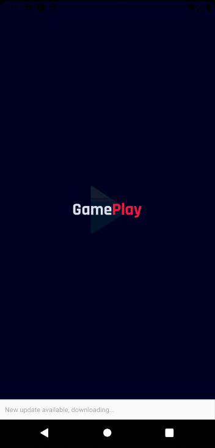
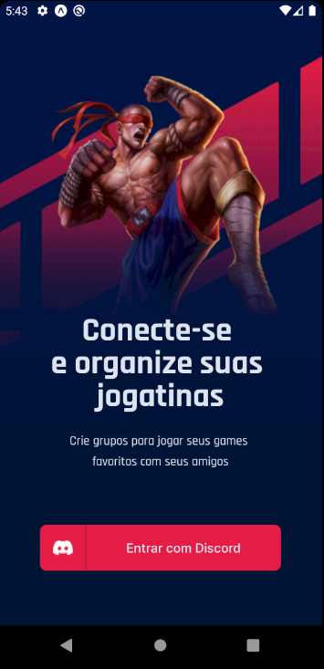

# GamePlay

## Descrição

Um app para organizar a sua jogatina. O GamePlay tem integração com o Discord e te ajuda a organizar partidas com seus amigos.

## Tecnologias

As seguintes ferramentas foram usadas na construção do projeto:

- [React Native](https://reactnative.dev/)
- [React Navigation](https://reactnavigation.org/)
- [Expo](https://expo.io/)
- [react-native-async-storage/async-storage](https://react-native-async-storage.github.io/async-storage/)
- [react-native-uuid](https://github.com/eugenehp/react-native-uuid)
- [react-native-svg](https://github.com/react-native-svg/react-native-svg)
- [react-native-svg-transformer](https://github.com/kristerkari/react-native-svg-transformer)
- [axios](https://github.com/axios/axios)
- [dotenv](https://github.com/motdotla/dotenv)

## Rodando o Projeto

Para executar esta aplicação, você precisará de [Git](https://git-scm.com/), [Node.js](https://nodejs.org/en/) + [Yarn](https://yarnpkg.com/) e [Expo](https://expo.io/) instalados na sua máquina. Da sua linha de comando execute:

```bash
# Clone este repositório
$ git clone https://github.com/lucas-salles/gameplay.git

# Acesse a pasta do projeto
$ cd gameplay

# Instale as dependências
$ yarn install

# Execute o app (Android)
$ expo start
```



